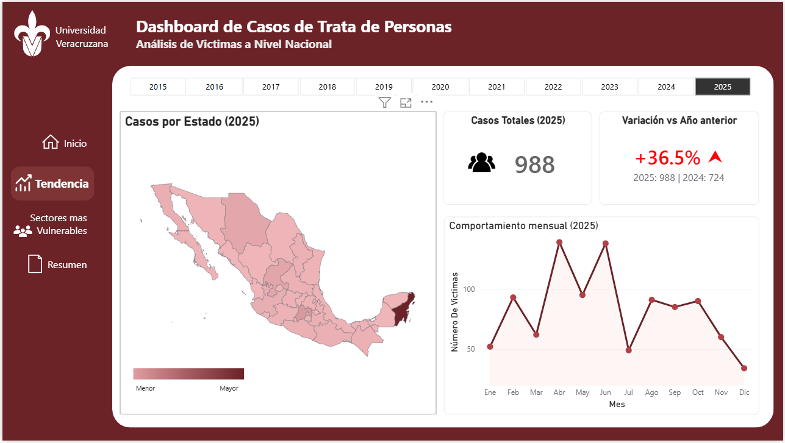
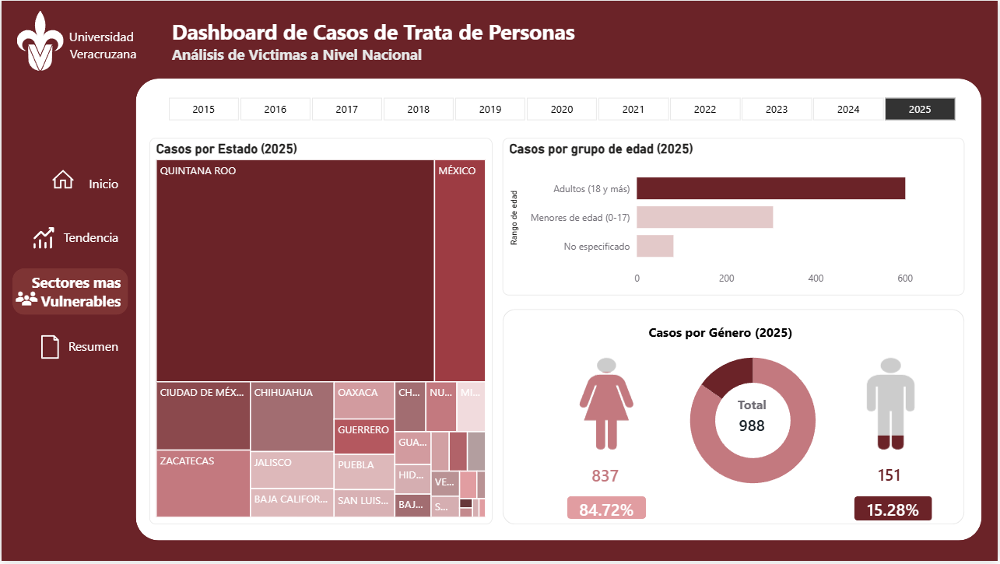
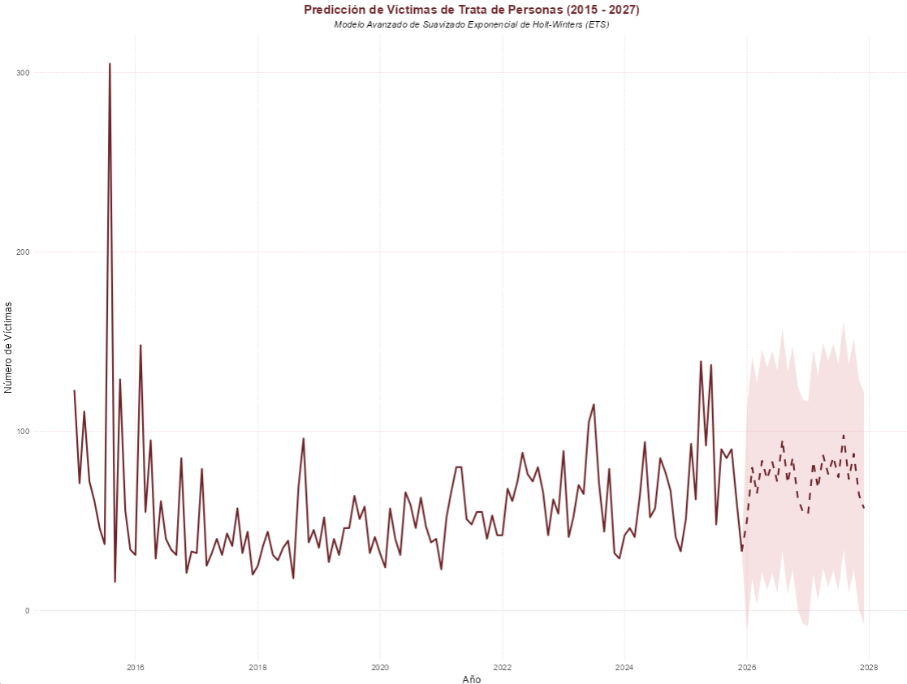

# Dashboard Trata de Personas en México (ODS 8.7)

[](https://app.powerbi.com/view?r=eyJrIjoiNjhhNzVkM2MtN2YxZC00YTQ5LWJlYjItZTQyZmIxOGE3ZDhiIiwidCI6IjNjOTA3NjUxLWQ4YzYtNGNhNi1hOGE0LTZhMjQyNDMwZTY1MyIsImMiOjR9)
[](https://www.r-project.org/)


Dashboard analítico e interactivo diseñado para la exploración, diagnóstico y monitoreo del delito de **Trata de Personas en México**. El proyecto se alinea de forma estricta con la **Agenda 2030 de la ONU**, abordando el **Objetivo de Desarrollo Sostenible (ODS) 8** (Trabajo decente y crecimiento económico) bajo la **Meta 8.7**, orientada a la eliminación de las formas contemporáneas de esclavitud y explotación.

👉 **[Acceder al Dashboard Interactivo en Power BI Service](https://app.powerbi.com/view?r=eyJrIjoiNjhhNzVkM2MtN2YxZC00YTQ5LWJlYjItZTQyZmIxOGE3ZDhiIiwidCI6IjNjOTA3NjUxLWQ4YzYtNGNhNi1hOGE0LTZhMjQyNDMwZTY1MyIsImMiOjR9)**

---




## 📌 Objetivos Analíticos

La solución busca generar información estratégica para tomadores de decisiones y organizaciones de derechos humanos, a través de los siguientes ejes de análisis:
*   **Perfiles demográficos vulnerables:** Distribución de casos por sexo y rangos de edad.
*   **Evolución temporal:** Análisis del volumen y evolución de la incidencia delictiva mensual y anual histórica.
*   **Distribución geográfica:** Densidad y distribución geográfica del impacto delictivo a nivel de entidades federativas.

---

## 📂 Estructura del Repositorio

El repositorio sigue las mejores prácticas de arquitectura de proyectos de datos para garantizar la modularidad y reproducibilidad del pipeline:

```text
trata-personas-mexico-ods87/
│
├── data/
│   ├── raw/                  # Dataset original crudo del SESNSP (Latin1)
│   └── processed/            # Dataset limpio, transformado y estructurado por el script de R
│
├── scripts/
│   └── 01_data_cleaning.R    # Pipeline automatizado de Data Wrangling en R
│   └── 02_time_series.R       # Descomposición STL y Modelado Predictivo (Holt-Winters)
│
├── dashboard/
│   └── reporte_trata_v1.pbix # Archivo ejecutable del Dashboard de Power BI
│
├── .gitignore                # Reglas de exclusión para archivos temporales e históricos
├── LICENSE                   # Licencia de código abierto MIT
└── README.md                 # Documentación principal del proyecto

```

---

## 🛠️ Tecnologías Utilizadas y Requisitos

* **R & Positron / VS Code:** Para la ingesta, limpieza y formateo de datos masivos.


* Librerías requeridas: `readr`, `dplyr`, `tidyr`, `lubridate`.


* **Power BI Desktop / Service:** Para el modelado dimensional, diseño de interfaz interactiva y publicación en la nube.


---


## ⚙️ Pipeline de Datos

La fuente primaria proviene del **Secretariado Ejecutivo del Sistema Nacional de Seguridad Pública (SESNSP)** de México (*Víctimas de Delitos del Fuero Común*). Debido a que la base se publica en un formato ancho (*wide format*) optimizado para tareas administrativas, el script `01_data_cleaning.R` realiza de forma automatizada las siguientes fases de transformación:

1. **Normalización de Cadenas (`toupper`):** Conversión estricta a mayúsculas en los campos `Tipo de delito` y `Sexo` para mitigar inconsistencias de captura y asegurar la integridad de los filtros.


2. **Filtrado de Inclusiones:** Aislamiento exclusivo del delito de `"TRATA DE PERSONAS"` y depuración de registros para retener únicamente categorías de género válidas (`MUJER` y `HOMBRE`).


3. **Pivotaje Dinámico (`pivot_longer`):** Transformación de la estructura del dataset de formato ancho a formato largo (*long format*), transponiendo las 12 columnas mensuales en filas independientes para un óptimo análisis secuencial.


4. **Estandarización Temporal (`make_date`):** Generación del campo indexable `FechaHecho` (estableciendo por convención el día uno de cada mes) a partir del año original y el mes numérico correlativo (`MesNum`).


5. **Enriquecimiento Geográfico (`Codigo_Estado_JSON`):** Creación automatizada de claves estándar de tres dígitos precedidas por el código de país (ej. `MXAGU` para Aguascalientes) para asegurar la compatibilidad nativa e interactiva con los mapas coropléticos del lienzo.


El entregable final optimizado se exporta en la ruta `data/processed/dataset_completo_limpio.csv` para alimentar de manera directa el modelo relacional del dashboard.

# Análisis de Series de Tiempo y Forecasting

El script 02_time_series.R ejecuta un estudio estadístico avanzado para comprender y proyectar la estructura del fenómeno penal:

    Descomposición STL (Seasonal and Trend using Loess): Desglosa de forma matemática la serie histórica para aislar y analizar de manera independiente la tendencia de fondo, la estacionalidad periódica y el residuo irregular[cite: 1].

    Modelado Holt-Winters (ETS - A,Ad,A): Implementa un modelo de suavizado exponencial con tendencia aditiva amortiguada (damped trend) y estacionalidad aditiva[cite: 1].

    Parámetros estimados: Nivel con baja reactividad al ruido de corto plazo (α=0.0062) y una estructura estacional rígidamente persistente y cíclica (γ=0.0001)[cite: 1].

    Justificación de la Amortiguación (ϕ=0.9488): Modera la tendencia de la previsión a largo plazo, evitando proyecciones infinitas o desproporcionadas y garantizando un comportamiento realista acorde a la naturaleza delictiva[cite: 1].

    Métricas de Rendimiento: El ajuste logró un RMSE entrenado de 29.51 y un MAPE de 37.89%, valores competitivos dada la alta volatilidad histórica del registro criminal[cite: 1].

    Anclaje de Nodos: Se programó una transición visual continua entre el cierre histórico observado de la serie y el vector de pronóstico futuro para mitigar desfases visuales en el gráfico del lienzo, proyectando los escenarios de los años 2026 y 2027[cite: 1].



---
**Este dashboard forma parte de un trabajo académico desarrollado en la Universidad Veracruzana, dentro de la Facultad de Estadística e Informática, correspondiente a la Licenciatura en Ingeniería de Ciencia de Datos.
El proyecto se elaboró en el marco de la asignatura Visualización de Datos, con el propósito de aplicar técnicas analíticas y de representación gráfica para la comprensión y comunicación de fenómenos complejos.**

**Desarrollado por el Equipo 7** - Licenciatura en Ingeniería en Ciencia de Datos, Universidad Veracruzana.

```
 MUÑOZ TAPIA EMMANUEL DE JESUS 
 ROMERO BONILLA JUAN PABLO  
 SALDAÑA CONDE HECTOR 

```